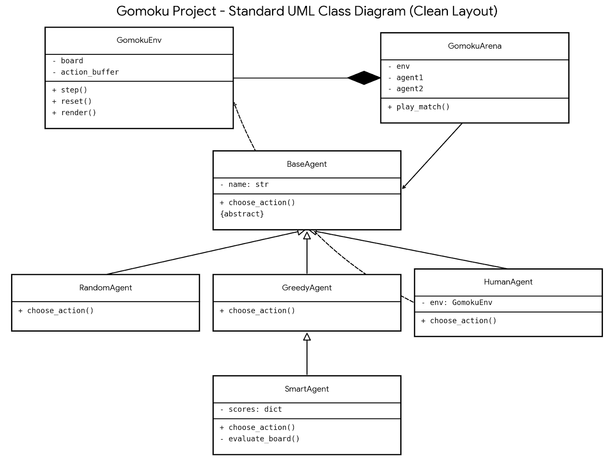

# OOP final project 第六組
## 1.Project Overview :
### PART 2 Frozen lake
### 專案目標：訓練一個強化學習Agent，在8x8的冰湖滑溜環境中，成功避開冰洞並抵達終點。
### 挑戰：
#### 環境滑溜：移動動作有2/3機率隨機滑動，增加了狀態轉移的不確定性。
#### 稀疏獎勵：只有抵達終點才有分數(+1)，其餘皆為0。
### 核心方法:
#### 採用Q-Learning演算法。
#### 設計Epsilon在前60%回合緩慢衰減，後40%保持最低值以穩定收斂。
#### 修正np.argmax在Q值全為0時的預設偏差，增加初期隨機性。
### 結果:
#### 大概60~62%
### 未達70%目標的解決方法:
#### 使用隨機生成地圖來讓坑洞減少
### 結果:
#### 大概0~99% (0%是因為可能生成無法到達終點的地圖)
### 
### PART 3 五子棋AI對戰系統
### 架構：
#### 三大模組：
##### 1.Model(GomokuEnv)：負責遊戲規則、棋盤狀態、畫面渲染(封裝)
##### 2.Controller(GomokuArena)：負責管理比賽流程、輪替玩家(組合)
##### 3.Agent(BaseAgent)：定義AI的思考邏輯(抽象/繼承)
#### OOP-抽象：
##### 定義BaseAgent為抽象class
##### 強制所有children class實作choose_action()
#### OOP-繼承：
##### RandomAgent、GreedyAgent繼承自BaseAgent
##### 重點：SmartAgent繼承自GreedyAgent
##### 目的：SmartAgent直接沿用父類別的winning_move & 
#### OOP-多型：
##### Arena中呼叫agent.choose_action()時，不需要知道對手是誰
##### 隨機AI->亂下；聰明AI->算分後下
##### 目的：提升系統彈性，程式碼解耦
#### OOP-封裝：
##### _evaluate_board()、_check_win_simulation()將複雜邏輯隱藏在class內
##### 目的：外部只需取得結果，不需干涉運作
#### AI演算法Greedy：
##### 特色：規則式，反應快速但短視近利
##### 1.進攻：這一步能贏嗎？ -> 下這裡(Win)
##### 2.防守：對手下一步會贏嗎？ -> 擋這裡(Block)
##### 3.搶地：天元(中心點)是空的嗎？ -> 佔領中心
##### 4.隨機：以上皆非 -> 隨機下
#### AI演算法Smart：
##### 特色：啟發式搜尋，模擬人類判斷
##### 設立棋型評分表
##### 攻守權衡公式 Score = (MyScore) - (OpponentScore * 0.9) 同時考慮「自己得分」與「阻礙對手」


## 2.Dependencies :
#### 請先下載老師提供的Gymnasium v1.2.2跟以上zip file後照著以下步驟初始化： 
```bash
# 1. Install python 3.12
brew install python@3.12

# 2. Create a virtual environment
python -m venv .venv

# 3. Activate the virtual environment
source .venv/bin/activate

# 4. Install 
#    Gymnasium v1.2.2
#    matplotlib
pip install "gymnasium[classic_control]==1.2.2" numpy matplotlib pygame
```

## 3.How to run :
### Part 1:
```bash
# Train the agent
python3.12 mountain_car.py --train --episodes 5000

# Render and visualize performance
python3.12 mountain_car.py --render --episodes 10
```
### Part 2:
#### 先cd到part2資料夾中
```bash
python3.12 frozen_lake.py
```
### Part 3:
#### 先cd到part3資料夾中
```bash
python main.py
```

## 4.Contribution list :
|Work|Name|Name|
|---|---|---|
|readme.md|童煜凱|楊紘鈞|
|part1|-|-|
|part2|童煜凱|-|
|part3|楊紘鈞|-|